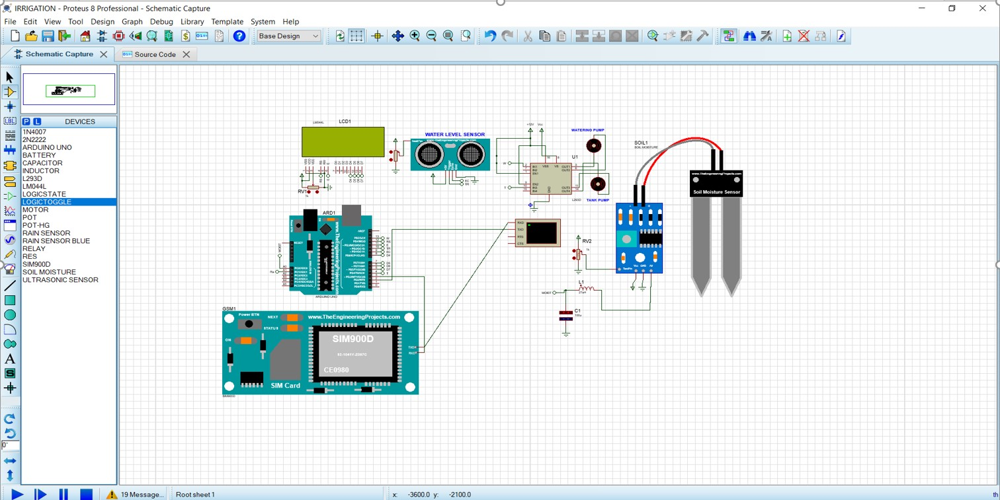

# Automatic Irrigation System

## Objective 
The primary goal of automating the irrigation process is to reduce water waste. Also, to reduce the amount of time required for human monitoring. An improved irrigation system can help with the efficient management of water used in crop production. The Automatic Irrigation system will use soil sensors to measure soil content, as well as water sensors to measure water levels in tanks and watering pumps. An LCD display will show the soil moisture levels, as well as the tank and pump levels. Furthermore, rain sensors will alert the farmer when it rains, giving the farmer complete control over plant irrigation based on their needs.
## Social Values
Field irrigation management is becoming more complex as a result of the enormous demand from the world's large and growing population. In comparison to the vast farmlands, the number of farmers is small. A smart automated technology for irrigation system monitoring will be able to cut farmers' work while also making irrigation significantly more efficient because it is controlled by sensors that gather readings from the environment and irrigate the fields accordingly.
## Required Components
- Arduino 
- Motor-PWMSERVO 
- LCD Display (LM044L) 
- Ultrasonic Sensor 
- Soil Moisture Sensor 
- Water pump
- Water Tank 
- Male & Female Wire
## Design

## Working Procedure
The Components that take stimuli from environment are
 - Soil Moisture Sensor 
 - Ultrasonic Sensor
So, the soil Moisture sensor takes the moisture content of the soil and then displays the value on the LCD screen, this value dictates whether the plants need water from the pump or not, if the Value goes below a certain level, then it will activate the Watering Pump to flow water into the fields which will water the plants. The Ultrasonic sensor will also indicate the water levels inside the tank.
The components that react to input are 
- Servo Motor 
- LCD 
- Watering Pump
- Tank Pump
The Input from the environment will let the LCD monitor display it in necessary detail with levels of moisture in the soil, the level of Water in the tank. Based on these readings the irrigation system turns on the watering pump with the use of fully automated motors that supply water through the plants and also stop the supply when the soil has adequate moisture in it.

